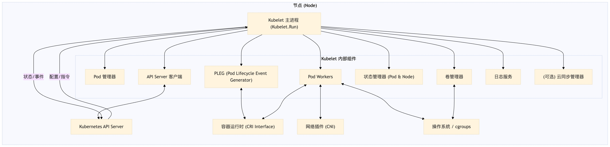
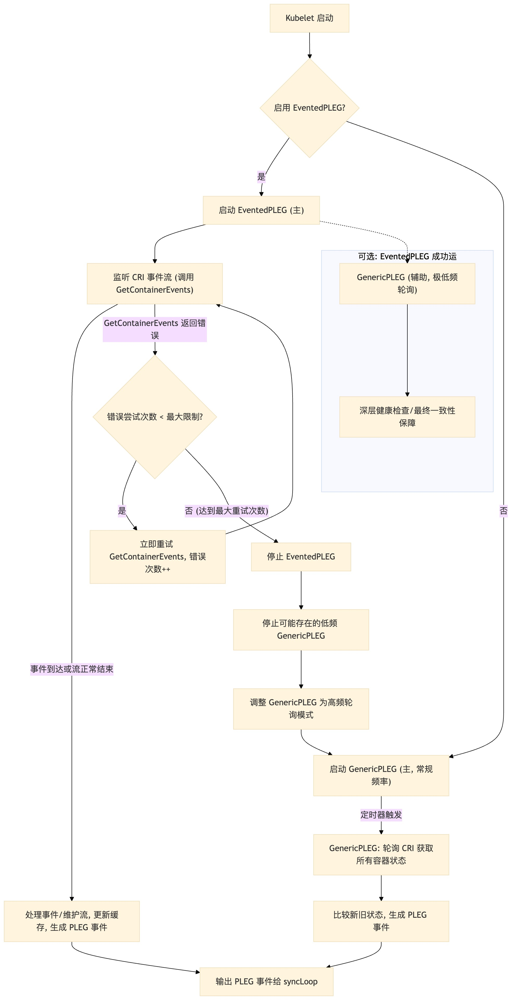
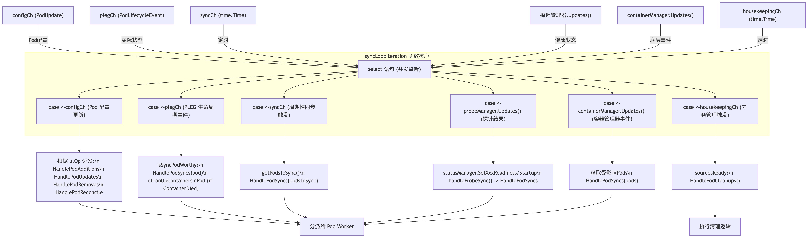

+++

date = '2025-05-06T11:22:12+08:00'
draft = false
title = 'K8s源代码分析：Kubelet(1)-主循环'

+++

## Kubelet 主工作流程源码深度剖析

Kubelet 是 Kubernetes 集群中每个节点上运行的核心组件，它负责管理 Pod 的生命周期、与容器运行时交互、上报节点和 Pod 状态等。本文将深入分析 Kubelet 的主工作流程，从启动函数 `Run` 开始，逐层解析其核心组件和循环机制。

### 一、Kubelet 的启动入口：`Kubelet.Run()` 函数



`Kubelet.Run()` 函数是整个 Kubelet 服务的起点，负责完成一系列初始化工作并启动各个后台服务和主工作循环。

```go
func (kl *Kubelet) Run(updates <-chan kubetypes.PodUpdate)
```

它的主要启动步骤包括：

1. **日志服务初始化**：

   1. 设置 Kubelet 的 HTTP 日志服务，允许通过 API 访问节点上的日志文件。如果特定功能门控开启，还会支持更高级的日志查询功能。

2. **API Server 客户端校验**：

   1. 通过检查 `if kl.kubeClient == nil` 判断是否配置了与 Kubernetes API Server 通信的客户端。如果没有配置，Kubelet 将无法向集群控制平面上报节点状态和 Pod 状态。

3. **启动云资源同步管理器** (如果配置)：

   1. 如果 Kubelet 配置了与特定云提供商集成的逻辑 (`kl.cloudResourceSyncManager != nil`)，则会启动一个后台 goroutine (协程) 来运行云资源同步管理器。
   2. `go kl.cloudResourceSyncManager.Run(wait.NeverStop)`
   3. 该管理器负责同步节点与云平台相关的资源，如网络路由、负载均衡器等。

4. **核心模块初始化**：

   1. 调用 `kl.initializeModules()` 初始化一系列不直接依赖容器运行时的内部模块。这些模块可能包括： 
      - 指标采集器 (Metrics Scraper)
      - Kubelet 目录结构管理器 (Directory Manager)
      - 证书管理器 (Certificate Manager)
      - OOM 监视器 (OOM Watcher)
      - 资源使用情况分析器 (Resource Analyzer)
   2. 这些模块的提前启动有助于 Kubelet 尽早准备好基础功能。
   3. **设计关键**：任何一个核心模块初始化失败，都会导致 Kubelet 进程以错误码 `1` 退出 (`os.Exit(1)`)，这表明了这些模块对于 Kubelet 正常运作的基础性和重要性。

5. **Cgroup 版本检查**：

   1. 检查节点上 Cgroup 的版本，Cgroup 是 Linux 内核提供的用于资源隔离和管理的关键特性，对容器的资源限制至关重要。

6. **与 API Server 的状态同步机制初始化**：

   1. 这是 Kubelet 与集群控制平面通信的核心部分，确保集群能够了解节点的健康状况和资源信息。仅当 `kl.kubeClient != nil` 时启动。 

      ```go
      if kl.kubeClient != nil {
          go func() { wait.JitterUntil(kl.syncNodeStatus, kl.nodeStatusUpdateFrequency, 0.04, true, wait.NeverStop) }() // 周期性上报 NodeStatusgo kl.fastStatusUpdateOnce()      // 初始化期间快速上报一次 NodeStatusgo kl.nodeLeaseController.Run(context.Background()) // 启动 node lease 心跳机制go kl.fastStaticPodsRegistration(ctx) // 提前注册静态 Pod 的 mirror pod
      }
      ```

   2. **节点状态上报 (****`kl.syncNodeStatus`****)**： 

      - 通过 `wait.JitterUntil` 工具函数周期性（默认为 `kl.nodeStatusUpdateFrequency`，通常是10秒）调用 `kl.syncNodeStatus()`。
      - `kl.syncNodeStatus()` 内部： 
        - 首先会调用 `kl.registerWithAPIServer()` 确保当前节点在 API Server 中有对应的 Node API 对象。如果对象不存在，则创建 (POST 请求)；如果存在但需要更新某些基本信息，则可能执行 PATCH 操作。
        - 然后，它会向 API Server 发送 PATCH 请求（例如 `PATCH /api/v1/nodes/<nodeName>/status`），专门更新 Node 对象的 `.status` 字段。这包括节点的资源容量 (`capacity`) 和可分配资源 (`allocatable`)、Pod 资源使用情况（特别是静态 Pod 的错误状态）、节点的各种状况 (`Conditions` 如 `Ready`, `MemoryPressure` 等）以及心跳时间。
        - **设计优点**：这种只 PATCH `.status` 子资源的方式比更新整个 Node 对象更高效。同时，结合 Lister-Watcher 模式和重试机制，保证了信息传递的效率和可靠性，使得调度器 (`kube-scheduler`) 和控制器管理器 (`kube-controller-manager`) 能及时获取准确的节点状态。
      - `wait.JitterUntil` 的作用： 
        - 它以 `period` 为基础周期，引入 `jitterFactor`（例如0.04代表±4%的时间抖动）来执行函数 `f`，直到 `stopCh` 通道关闭。
        - `sliding = true` 参数意味着新的周期从函数 `f` **执行完毕后**开始计算，这有助于避免因函数执行耗时不固定而导致的周期性任务实际执行时间的逐渐漂移。
        - **设计思考**：抖动机制可以防止集群中大量节点在同一精确时刻向 API Server 发送状态更新，从而避免造成瞬时负载高峰。滑动周期则保证了任务执行频率的稳定性。

   3. **快速状态更新 (****`kl.fastStatusUpdateOnce`****)**： 

      - 在 Kubelet 启动初期，此协程会以较高频率（例如每100毫秒）检测容器运行时和自身状态，并尝试尽快将节点状态更新为 `Ready`。
      - **设计目的**：减少集群感知新节点或重启节点就绪状态的延迟。例如，控制器管理器中的节点生命周期控制器依赖 `nodeMonitorGracePeriod` 来判断节点是否失联，快速的状态上报有助于在节点恢复时让控制平面更快感知，从而影响 Pod 的调度和管理。

   4. **节点租约心跳 (****`kl.nodeLeaseController`****)**： 

      - 启动节点租约控制器，使用 `coordination.k8s.io/v1` API 组的 `Lease` 对象来实现节点心跳。
      - 相比于完整的 `NodeStatus` 更新，`Lease` 更新非常轻量，仅表明 Kubelet "还活着"。默认每10秒续约一次租约。
      - **设计优点**：显著降低了大规模集群中节点心跳对 API Server 的压力。

   5. **静态 Pod 快速注册 (****`kl.fastStaticPodsRegistration`****)**： 

      - 静态 Pod 是由 Kubelet 直接在节点上通过本地文件（通常在特定目录下，如 `/etc/kubernetes/manifests/`）管理的 Pod，它们不经过 API Server 的调度。常用于运行如 `kube-apiserver` 这样的控制平面组件或关键的节点服务。
      - 为了让 API Server 和调度器能够“看到”这些静态 Pod 并计算它们的资源占用，Kubelet 需要为它们在 API Server 中创建对应的“镜像 Pod” (`Mirror Pod`)。
      - 由于 Kubernetes 组件间（如 Kubelet 与 API Server，API Server 与 Scheduler）的状态同步依赖 Informer 机制，可能存在一定的延迟。此协程的目的是在节点向集群注册成功后，尽快遍历静态 Pod 目录，读取 YAML 文件，并调用 API Server 创建这些镜像 Pod。
      - **设计目的**：提高调度器和集群其他组件对本地静态 Pod 资源占用的可见性，避免因信息滞后导致调度器对节点可用资源做出错误判断。例如，在 GPU 节点上，通过静态 Pod 部署的设备插件（如 NVIDIA GPU 插件）能更快地被调度器识别其提供的 GPU 资源。

7. **容器运行时状态监控 (****`kl.updateRuntimeUp`****)**：

   1. 启动一个后台协程，定期（例如每5秒）调用 `kl.updateRuntimeUp()`。
   2. 此函数通过调用容器运行时（如 Docker、containerd）的 `Status()` 接口，检查运行时的健康状况，特别是网络是否就绪 (`NetworkReady`) 和运行时本身是否就绪 (`RuntimeReady`)。
   3. 如果检测到异常（例如网络插件未成功加载导致网络未就绪），会更新 Kubelet 内部的 `runtimeState` 对象中的错误信息。这个状态会影响后续节点状态的上报（例如，可能导致 `NodeReady` 条件变为 `False`）。
   4. **首次执行的特殊逻辑**：`kl.updateRuntimeUp()` 在首次成功执行时，通常会使用 `sync.Once` 来确保一次性初始化那些依赖于容器运行时的模块（例如 CNI 网络插件的设置）。
   5. **设计核心**：通过一个集中的状态同步点，将底层容器运行时的动态健康状况高效地映射到 Kubelet 的内存状态 (`runtimeState`)中。这个 `runtimeState` 为 Kubelet 的其他模块（如节点状态管理器、PLEG、驱逐管理器）提供了一致且低延迟的运行时健康信息访问接口，进而影响： 
      - **NodeReady 状态判定**：`runtimeState` 中的错误会通过节点状态管理器 (`NodeStatusManager`) 转换为节点的具体 `Condition`，并由 `syncNodeStatus` 上报给 API Server。
      - **PLEG 事件生成**：PLEG 会检查运行时是否就绪，如果运行时出现问题，PLEG 可能会暂停事件生成或采取降级措施。
      - **驱逐决策**：驱逐管理器 (`EvictionManager`) 会结合 `runtimeState` 中反映的资源压力（如内存压力标记）和来自 cAdvisor 的监控指标，来决定是否需要驱逐 Pod。

8. **网络规则初始化 (****`kl.initNetworkUtil`****)** (如果配置)：

   1. 如果 `kl.makeIPTablesUtilChains` 为 `true`，则调用此函数。
   2. 负责在节点上配置必要的 `iptables` 规则和链，例如 `KUBE-SERVICES`、`KUBE-FORWARD` 等，这些是实现 Kubernetes Service 负载均衡和 Pod 网络策略的基础。

9. **Pod 状态同步管理器 (****`kl.statusManager`****)**：

   1. 启动 `statusManager`，它负责维护 Pod 的状态缓存，并将这些状态（特别是 `.status` 字段）同步到 API Server。

   2. `statusManager` 内部通常有一个循环，通过 `select` 监听两个主要的触发信号： 

      ```go
      // statusManager 内部循环示意for {
          select {
          case <-m.podStatusChannel: // 接收到特定 Pod 状态变更的信号
              m.syncBatch(ctx, false) // 执行增量/批量同步case <-syncTicker: // 定期全量同步的 Ticker
              m.syncBatch(ctx, true) // 执行全量同步
          }
      }
      ```

   3. **事件驱动与周期驱动结合**：通过 `m.podStatusChannel` 实现对特定 Pod 状态变更的快速响应（增量同步）。同时，通过一个内部的 `syncTicker` 实现周期性的全量状态同步。全量同步有助于清理那些在 API Server 中存在但本地已不存在对应 Pod 的陈旧状态记录（通过比较 `apiStatusVersions`）。

   4. `syncBatch` 方法会进一步调用 `syncPod` 来处理单个 Pod 的状态同步，其逻辑包括： 

      - 对比 Kubelet 内存中的 Pod 状态与从 API Server 获取的最新状态。
      - 处理 UID 冲突（例如，静态 Pod 被删除后又以相同 UID 重新创建的情况）。
      - 合并本地计算的状态和 API Server 上的状态，准备 PATCH 数据。
      - 向 API Server 提交 PATCH 请求，仅更新有差异的 `.status` 部分。
      - 记录状态同步延迟相关的度量指标。
      - 更新本地维护的、已成功同步到 API Server 的 Pod 状态版本号 (`apiStatusVersions`)。
      - 处理优雅删除的最后阶段：当 Pod 在节点上完全终止后，可能需要清理其在 API Server 上的记录或更新最终状态。
      - 处理 API 请求冲突或网络错误，通常包含自动重试逻辑。

10. **多容器运行时支持 (****`kl.runtimeClassManager`****)** (如果启用)：

    1. 启动 `runtimeClassManager`，用于管理 `RuntimeClass` 这种 API 资源。
    2. `RuntimeClass` 允许集群管理员定义不同的容器运行时配置（例如使用 Kata Containers 或 gVisor 等沙箱运行时），并让用户在 Pod Spec 中通过 `runtimeClassName` 字段来选择使用哪种运行时。
    3. 该管理器会监听 `RuntimeClass` 对象的变化，并动态加载相应的运行时配置。

11. **Pod 生命周期事件生成器** ( **PLEG -`PodLifecycleEventGenerator`**)：

    

    1. PLEG 的核心职责是监控节点上容器运行时的状态变化（如容器的启动、停止、崩溃、删除等），并将这些变化转换为抽象的 Pod 生命周期事件。这些事件随后会驱动 Kubelet 的主同步循环 (`syncLoop`) 去更新 Pod 的内部状态并执行相应的操作。

    2. Kubelet 会启动主 PLEG 实例。默认情况下，这可能是 `GenericPLEG`。如果 `EventedPLEG` 特性门控被启用，并且条件满足，则会优先使用或尝试启动 `EventedPLEG`。

    3. **`GenericPLEG`**： 

       - 基于**轮询 (polling)** 机制工作。它会定期（例如每秒一次）主动查询容器运行时的所有 Pod 和容器状态。
       - 通过比较本次查询到的状态与上一次记录的状态（在其内部的 `podRecords` 中），调用 `computeEvents` 来识别出哪些容器发生了生命周期变化（如 `ContainerStarted`, `ContainerDied`, `ContainerRemoved`）。
       - 对于状态发生变化的 Pod，`GenericPLEG` 可能会获取更详细的状态信息，并更新其内部维护的一个共享缓存 (`g.cache`)。这个缓存是 Kubelet 主同步循环 (`syncLoop`) 观察 Pod 实际状态的重要数据来源之一。
       - 如果检测到某些预设的条件被满足（例如，所有容器都进入了某种状态），可能会生成一个通用的 `ConditionMet` 事件。
       - 所有生成的事件都会被发送到一个事件通道 (`g.eventChannel`)，Kubelet 的 `syncLoop` 会监听这个通道，并根据事件对相应的 Pod 执行同步操作 (`SyncPod`)。
       - 在每次 `Relist`（即一轮完整的状态检查和事件生成）完成后，`GenericPLEG` 会更新其内部缓存的全局时间戳，表明缓存数据刷新至该时间点。
       - **设计局限**：在节点上 Pod 和容器数量非常多，或者状态变化频繁的高负载场景下，频繁的轮询和状态对比可能会带来一定的性能开销（CPU消耗）。

    4. **`EventedPLEG`** (通常在较新版本中作为 Beta 或 GA 特性)： 

       - 旨在通过利用容器运行时接口 (CRI) 提供的**事件流 (event stream)** 机制，来更实时、更高效地响应容器状态变化，从而降低轮询带来的延迟和 CPU 开销。

       - 其核心工作在一个 `watchEventsChannel` 循环中： 

         - **容器事件流监听与降级处理**： 

           - `EventedPLEG` 会尝试与容器运行时建立一个 gRPC 长连接，通过这个连接实时接收容器生命周期事件。 

             ```go
             // EventedPLEG 尝试获取事件流
             err := e.runtimeService.GetContainerEvents(context.Background(), containerEventsResponseCh, func(runtimeapi.RuntimeService_GetContainerEventsClient) {
                 metrics.EventedPLEGConn.Inc() // 增加连接计数器指标
             })
             ```

           - 当事件流连接发生异常时（例如网络问题或运行时重启），`EventedPLEG` 会采用指数退避策略进行重试连接。

           - 每次连接失败都可能触发一次强制的、全量的状态同步（relist），以确保 Kubelet 不会因为事件流中断而丢失状态更新。同时会记录错误相关的度量指标，供监控系统报警。

           - 如果连接连续失败的次数超过预设的阈值（例如 `eventedPlegMaxStreamRetries`），`EventedPLEG` 会执行**降级 (fallback)** 操作，切换回使用 `GenericPLEG` 作为主要的事件来源。这个降级过程通常包括： 

             ```go
             // EventedPLEG 降级到 GenericPLEG 的示意逻辑
             e.Stop()                  // 停止 EventedPLEG 的所有协程
             e.genericPleg.Stop()      // 停止原先可能在低频运行的 GenericPLEG (如果存在)
             e.Update(e.relistDuration) // 通常是将 GenericPLEG 的轮询周期调整为一个更频繁的值 (例如从默认的10分钟缩短至1秒)
             e.genericPleg.Start()     // 启动调整后（高频）的 GenericPLEG 作为兜底方案
             ```

           - **设计思考**：这种降级机制确保了即使先进的事件驱动模式失败，Kubelet 依然有可靠的（尽管可能性能稍逊的）轮询机制来保证其核心功能的运作。

         - **`EventedPLEG`** **与** **`GenericPLEG`** **的协同**：当 `EventedPLEG` 正常工作时，它成为主要的事件源。`GenericPLEG` 此时可能仅以非常低的频率运行（例如，执行一个周期非常长的 `relist` 作为深度的“健康检查”或“最终一致性”保障）。如果 `EventedPLEG` 降级，则 `GenericPLEG` 会被调整为高频运行模式接管。为了确保数据一致性（例如，在切换瞬间或两者都有机会更新缓存时），通常会依赖事件或状态的时间戳来决定哪个数据更新，防止旧数据覆盖新数据。

         - **`updateGlobalCache`** **的定期调用**：`EventedPLEG` 也会定期调用一个类似 `updateGlobalCache` 的函数。其主要目的是更新其内部缓存的全局时间戳，并可能通知订阅者。这可以作为一种**心跳机制**，表明 `EventedPLEG` 仍在活跃，并且其维护的缓存数据具有一定的新鲜度。

       - **事件处理**: 无论事件来自 `EventedPLEG` 还是 `GenericPLEG`（在降级后），它们最终都会通过 PLEG 提供的统一事件通道 (`plegCh`) 传递给 Kubelet 的主同步循环 (`syncLoop`)，触发后续的 Pod 状态同步逻辑。

12. **健康检查与自愈 (****`kl.healthChecker`****)** (如果启用)：

    1. 如果 `SystemdWatchdog` 特性门控被启用，Kubelet 会启动 `healthChecker`。
    2. 这个组件通常与 `systemd` 的 watchdog 机制集成。Kubelet会定期向 `systemd` 发送“心跳”信号。如果 `systemd` 在预设的超时时间内没有收到心跳，它会认为 Kubelet 进程卡死或不健康，并可能会根据配置触发 Kubelet 进程的重启。
    3. **设计思考**：这是一种依赖外部监控实现的进程级自愈能力。通常还会包含限流策略（例如，限制在特定时间窗口内重启的最大次数），以防止由于底层问题导致 Kubelet 频繁无效重启。

13. **进入核心：Pod 状态同步主循环 (****`kl.syncLoop`****)**：

    1. 在所有初始化步骤完成后，`Run` 函数的最后会调用 `kl.syncLoop(...)`，这标志着 Kubelet 进入了其最核心的工作状态。

    2. `syncLoop` 是一个永不退出的循环（除非 Kubelet 关闭或遇到不可恢复的错误）。它负责： 

       - 监听并聚合来自多个源的 Pod 配置变更（通过 `updates` 通道）。
       - 接收来自 PLEG 的 Pod 实际运行时状态变更事件 (`plegCh`)。
       - 响应内部的周期性触发器（如 `syncTicker` 和 `housekeepingTicker`）。
       - 最终目标是持续地将节点上 Pod 的实际状态与 Kubelet 感知的期望状态进行协调和同步。

    3. **`syncLoop`** **初始化阶段**： 

       - 设置各种**定时器 (Tickers)**: 
         - `syncTicker` (例如每秒触发一次): 用于频繁地唤醒 `syncLoopIteration`，检查是否有 Pod Worker 需要被同步。这使得 Kubelet 能够对某些内部状态变化（如 Pod Worker 完成了上一个任务）做出快速响应，而不必等待一个可能较长的全局同步检查周期。
         - `housekeepingTicker` (例如每 `housekeepingPeriod`，通常是2秒): 用于周期性地触发内务管理任务，如清理孤立资源、执行 Pod 的健康探针（尽管探针现在更多由专门的 manager 处理，但 housekeeping 可能包含相关的清理或状态检查）、上报 Pod 状态的某些方面等。
       - **订阅 PLEG 事件**: 调用 `kl.pleg.Watch()` 获取 PLEG 事件通道 (`plegCh`)，这是获取 Pod“实际运行时状态”变化的关键输入。
       - **初始化指数退避机制**: 设置用于在容器运行时出现故障时进行退避的参数 (`base`, `max`, `factor`)，以防止 Kubelet 在运行时不稳定时过于频繁地尝试同步操作，从而浪费资源或加剧问题。
       - **DNS 配置检查**: 对节点的 `/etc/resolv.conf` 文件执行一次性的内容或格式限制检查（如果配置了 `dnsConfigurer`）。

    4. **`syncLoop`** **主循环体**: 

       - **运行时健康检查**: 在每次迭代开始时，首先检查容器运行时是否健康。如果不健康（例如，`kl.runtimeState.runtimeErrors()` 返回错误），则执行指数退避（等待 `duration` 时间，然后增加 `duration`），并跳过本次迭代的同步逻辑。如果健康，则将退避的 `duration` 重置为初始的 `base` 值。

       - **循环监控**: 通过 `kl.syncLoopMonitor.Store(kl.clock.Now())` 在调用核心迭代逻辑前后更新时间戳。这个时间戳可以被外部的健康检查机制（或 Kubelet 自身的某个监控）用来判断 `syncLoop` 是否活跃（没有卡死）。

       - **核心迭代逻辑 **(`kl.syncLoopIteration`): `syncLoop` 将实际的事件处理和同步分派逻辑委托给 `kl.syncLoopIteration` 函数。 

         

         - `syncLoopIteration` 是真正执行每一次循环迭代工作的地方。它通过一个 `select` 语句并发地监听多个事件通道： 
           - **`configCh`** **(Pod 配置更新)**: 处理来自 API Server、静态文件等的 Pod 期望状态的变更（增、删、改、协调）。根据 `PodUpdate` 中的操作类型 (`u.Op`)，调用 `handler` (即 Kubelet 自身) 的不同方法 (如 `HandlePodAdditions`, `HandlePodUpdates` 等)。
           - **`plegCh`** **(PLEG 生命周期事件)**: 处理来自 PLEG 的 Pod 实际运行时状态变化。 
             1. 通过 `isSyncPodWorthy(e)` 判断事件是否需要触发一次 Pod 同步。
             2. 如果需要且 Pod 仍然存在，则调用 `handler.HandlePodSyncs` 来同步该 Pod。
             3. 如果事件是 `ContainerDied`，还会额外调用 `kl.cleanUpContainersInPod` 执行针对该死亡容器的特定即时清理。
           - **`syncCh`** **(周期性同步触发)**: 通常由 `syncLoop` 内部的 `syncTicker`（例如每秒一次）驱动。 
             1. 调用 `kl.getPodsToSync()` 获取当前所有待同步的 Pod 列表。
             2. 然后调用 `handler.HandlePodSyncs` 对这些 Pod 进行批量同步。这是 Kubelet 实现最终一致性的重要保障机制。
           - **探针管理器更新 (Liveness, Readiness, Startup Probes)**: 分别监听来自 `livenessManager`、`readinessManager` 和 `startupManager` 的探针结果。 
             1. **Liveness Probe**: 失败时，通过 `handleProbeSync` 辅助函数记录事件、标记 Pod 不健康，并触发 Pod 同步，通常导致容器重启。
             2. **Readiness Probe**: 根据结果更新 `statusManager` 中容器的就绪状态，并通过 `handleProbeSync` 触发同步。容器就绪状态影响其是否接收服务流量。
             3. **Startup Probe**: 根据结果更新 `statusManager` 中容器的启动状态，并通过 `handleProbeSync` 触发同步。启动探针失败通常也导致容器重启。
           - **容器管理器更新 (****`kl.containerManager.Updates()`****)**: 处理来自底层容器管理器（与 CRI 交互，管理 cgroups、设备等）的事件。例如，节点资源限制变更或 OOM killer 事件，可能导致需要重新同步受影响的 Pod。
           - **`housekeepingCh`** **(周期性内务管理)**: 通常由 `syncLoop` 内部的 `housekeepingTicker` 驱动。 
             1. 在执行前会检查所有配置源是否就绪 (`kl.sourcesReady.AllReady()`)，防止在 Kubelet 未完全加载所有 Pod 配置前错误地清理资源。
             2. 调用 `handler.HandlePodCleanups` 执行实际的清理任务，如垃圾回收已终止的 Pod 和容器、清理孤立的数据卷等。
         - **设计精髓**: `syncLoopIteration` 通过其 `select` 机制，将 Kubelet 的行为模式从被动响应（等待事件）转为主动协调（周期性检查和清理）。它巧妙地将来自不同来源、性质各异的事件统一到一个处理模型中，并通过回调 `handler` 的具体方法来执行实际工作。这种设计既保证了对各类变化的及时响应，也维持了代码结构的清晰和模块化，使得 Kubelet 能够持续地将节点状态驱动向用户定义的期望状态，同时处理好运行时的各种动态事件和必要的维护工作。

    5. 在 `HandlePodSyncs` 中，Kubelet 会将同步任务进一步分派给所谓的 "Pod Workers"。通常，Kubelet 会为每个活跃的 Pod（由其 UID 标识）维护一个专用的 **Pod Worker** (表现为一个后台 goroutine/协程)。这个 Worker 负责串行地处理与其关联的那个 Pod 的所有更新和生命周期事件（如创建、删除容器，配置网络，挂载卷，执行探针等）。这样做的好处是，对单个 Pod 的操作是顺序执行的，避免了复杂的并发控制，而不同 Pod 之间的操作则可以并行处理，提高了整体效率。`HandlePodSyncs` 的作用就是将待同步的 Pod 信息和操作类型传递给对应的 Pod Worker。

### 二、进一步思考

1. **Pod Worker 的健壮性与资源管理**：
   1. **问题**：每个 Pod 一个 Worker 协程，虽然简化了单个 Pod 的并发控制，但在大规模节点（大量 Pod）的场景下，可能会创建非常多的协程。虽然协程本身轻量，但过多的协程仍可能带来调度开销和一定的内存足迹。此外，如果某个 Pod Worker 发生 panic 或长时间阻塞，如何确保其影响隔离，以及如何有效地恢复或重启该 Worker？
   2. **分析与思考**： 
      - 目前代码中提到了 `TODO: this should be a wait.Until with backoff to handle panics`，这表明设计者已意识到 Worker panic 的问题，并计划引入更健壮的重启和退避机制。
      - 可以考虑引入一个有限大小的 Worker 池来处理 Pod 更新，而不是无限制地为每个 Pod 创建协程，尤其是在 Pod 数量极多的情况下。但这会重新引入对单个 Pod 操作的并发控制问题，需要在池化带来的资源节约和增加的同步复杂性之间做权衡。
      - 对 Pod Worker 的资源消耗（CPU、内存）和执行时长进行更细致的监控和告警，有助于及时发现表现异常的 Worker。
2. **PLEG 降级与恢复机制的智能化**：
   1. **问题**：`EventedPLEG` 在连续失败后降级为高频 `GenericPLEG` 是一个很好的容错机制。但 `GenericPLEG` 性能开销较大。当导致 `EventedPLEG` 失败的外部条件（如容器运行时暂时不稳定）恢复后，Kubelet 是否有机制尝试自动恢复回 `EventedPLEG`？如果持续依赖高频 `GenericPLEG`，对节点性能可能造成长期影响。
   2. **分析与思考**： 
      - 可以设计一个“升級”探测机制。在降级到 `GenericPLEG` 后，Kubelet 可以定期（例如以一个较长的周期）尝试重新初始化 `EventedPLEG` 的事件流。如果几次尝试均成功且事件流稳定，则可以切换回 `EventedPLEG`，并将 `GenericPLEG` 调回低频或暂停状态。
      - 这种自动恢复机制需要仔细设计，避免在不稳定的环境中频繁切换 PLEG 模式。
3. **配置源就绪 (`sourcesReady`) 的精细化管理与超时**：
   1. **问题**：`housekeeping` 等操作会等待 `kl.sourcesReady.AllReady()`。如果某个配置源（例如 API Server 连接长时间不通畅）持续不就绪，可能会导致某些重要的后台任务（如垃圾回收）长时间无法执行。
   2. **分析与思考**： 
      - 可以考虑为 `sourcesReady` 的等待引入超时机制。如果超过一定时间仍有源未就绪，Kubelet 可以根据已就绪的源进行部分操作，或者发出更明确的告警。
      - 对于不同类型的后台任务，其对“所有源就绪”的依赖程度可能不同。例如，清理本地孤儿资源可能不完全依赖于 API Server 的就绪状态。可以考虑更细粒度的就绪判断。
4. **状态同步的优先级与公平性**：
   1. **问题**：`syncLoopIteration` 中的 `select` 语句在多个通道同时就绪时是伪随机选择的。这意味着在极端繁忙的情况下，某些类型的更新（例如，一个重要的 Pod 配置变更）可能会因为其他大量事件（如 PLEG 事件或探针事件）的涌入而略有延迟。
   2. **分析与思考**： 
      - 虽然 Go 的 `select` 本身不提供优先级，但可以通过架构设计来间接实现。例如，可以为不同类型的事件使用不同大小的缓冲通道，或者在 `syncLoopIteration` 内部维护一些优先队列，在 `select` 选中某个case后，从对应的优先队列中取出最重要的任务进行处理。
      - 然而，引入显式的优先级会增加系统的复杂性，需要仔细评估其带来的好处是否超过了复杂性的代价。目前 Kubelet 的设计似乎更倾向于通过快速的迭代和各组件的并发处理来保证整体的响应性。
5. **Kubelet 自身的可观测性与调试**：
   1. **问题**：Kubelet 是一个非常复杂的组件，当出现问题时，诊断和调试可能具有挑战性。
   2. **分析与思考**： 
      - 虽然 Kubelet 已经输出了大量的日志和度量指标，但可以考虑进一步增强其可观测性。例如，提供更细粒度的追踪信息（Tracing），允许开发者追踪一个 Pod 更新从接收到最终在节点上生效的完整路径和耗时。
      - 提供更多的动态调试接口或命令，允许在运行时查询 Kubelet 内部的特定状态（例如，某个 Pod Worker 的当前状态，`podSyncStatuses` 的详细内容等），而不仅仅依赖日志。
